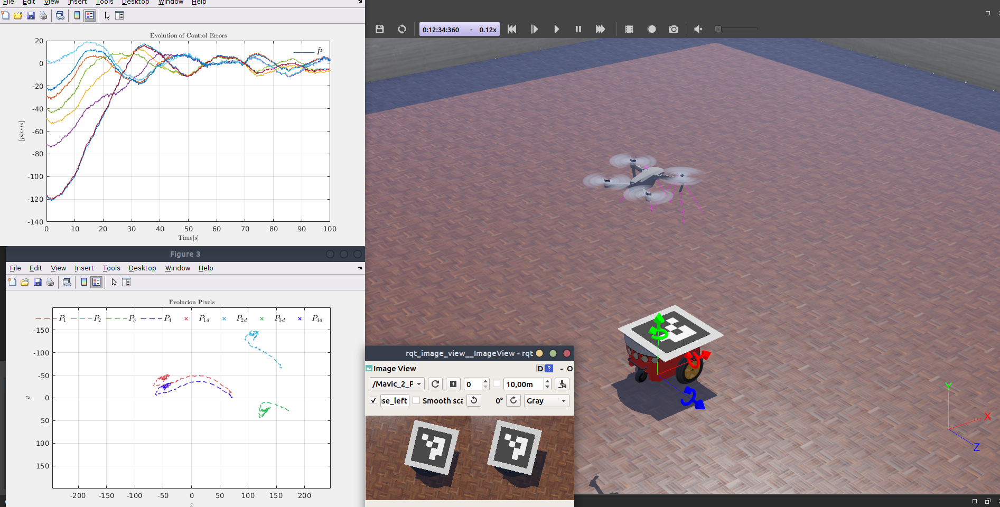

# Drone_Visual_Servoing
## Mavic Pro webots
## Use
```bash
Drone_VISUAL_SERVOING.m
```
<div align="center">                                                                                                   
</div> 